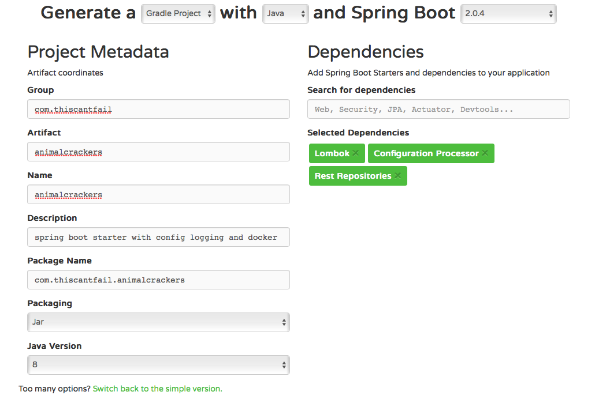
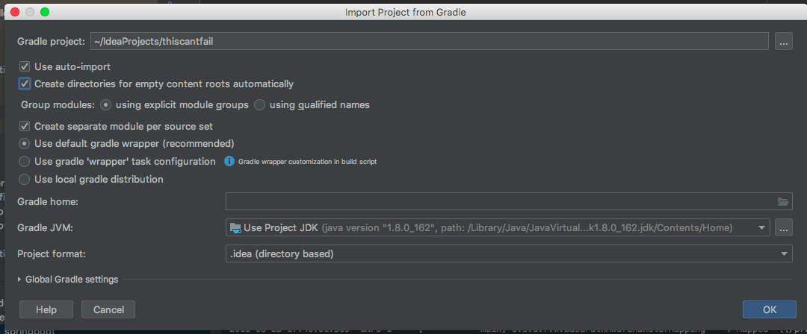
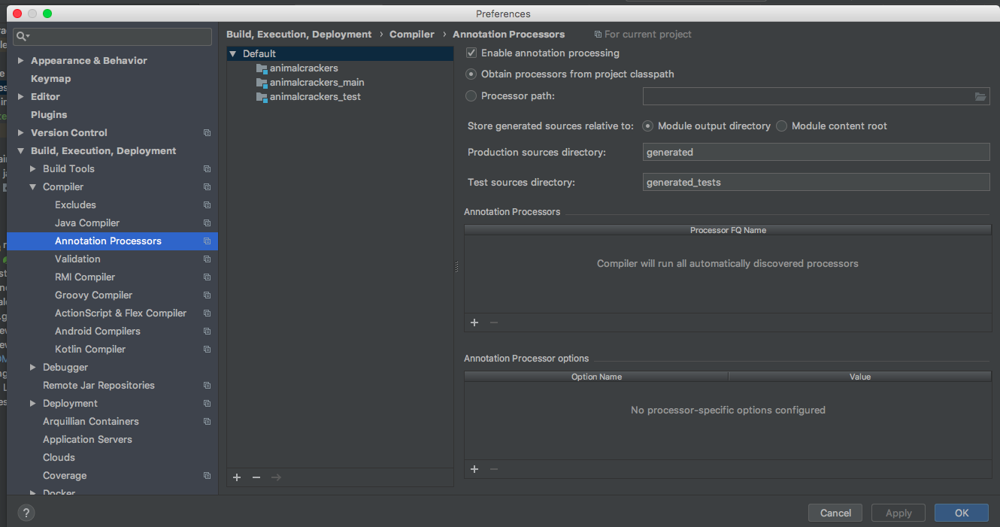
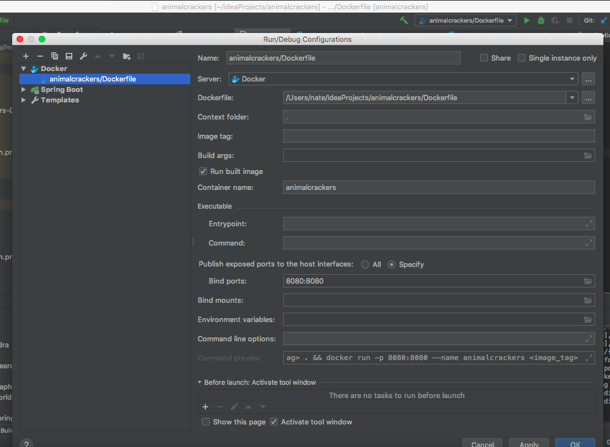

# Goals

 - Write and debug in Intellij
 - Build with gradle
 - Use Spring Boot Externalized Configuration: https://docs.spring.io/spring-boot/docs/current/reference/html/boot-features-external-config.html
 - Use logback (included in spring boot starter projects) and SLF4J for logging.  Logged output goes to the STDOUT in docker. This is important because it lets us set default values in the applicaiton.properties file, but also override those with environment variable settings in the docker container
 - Include a Dockerfile that adds the JAR and the external application.properties file to the Docker image
 - Use docker-compose to start the docker image and bind ports, etc to the host
 
# Getting Started

These are the steps to recreate this project and its development environment

## All spring projects start with initializr

https://start.spring.io

Select Gradle project:
Select full version:
After this, I use add dependencies for Lombok, Spring REST data and Configuration Processor



Download the initializer zip, unpack it and open it in Intellij like this:

*NOTE:* The project zip and folder name will actually be animalcrackers



## Intellij configuration

In Intellij enable annotation processing. It’s required for Lombok.



Install the Lombok plugin for Intellij

## Gradle Customization

Add: 
```
Apply plugin: ‘idea'
```

Add .gitignore settings for IntelliJ and  for Java

# First Milestone: Build and run the application

We create two class files and edit the resources/applicaiton.properties file

The AnimalcrackersConfigurationProperties class gives the application access to the configuration data in the application.properties file, specifically the 'response' attribute. This is also an example of using the Lombok getter and setter annotaitons to minimize boilerplate methods.

The AnimalcrackersBaseController class has the method the the '/' REST endpoint.  It uses the application property 'response' from AnimalcrackersConfigurationProperties to return a string when we run:

```
curl http://localhost:8080/
```

The logging level is set in resources/application.properties, too.  If it's set to DEBUG,  two messages (an INFO and  DEBUG ) should be printed to STDOUT everytime  the REST endpoint is used.  If it's set to INFO, there will just be one message.

#  Now do it in do

First, we've been building the  class files, now we want to put everything into a jar container file to make it easier to deploy.

Add this section to gradle:

```
bootJar {
	baseName = 'animalcrackers'
    version =  '0.1.0'
}
```

and run:

```
gradle clean build
```

This will create a new  buildin the build directory containing the jar:

build/libs/animalcrackers-0.1.0.jar

You can see all the files packed into the jar by running:

```
jar tf build/libs/animalcrackers-0.1.0.jar
```

Interestingly, this includes a copy ot the application.properties file:

```
jar tf build/libs/animalcrackers-0.1.0.jar  | grep proper
BOOT-INF/classes/application.properties

```

I think that will give us the default values for logging and response by just launching that JAR in the docker container. If we add another copy of that application.properties file into the docker container along side the jar the additional, external applicaiton.properties file values should override:

https://docs.spring.io/spring-boot/docs/current/reference/html/boot-features-external-config.html


14. Application properties outside of your packaged jar (application.properties and YAML variants).
15. Application properties packaged inside your jar (application.properties and YAML variants).

Also note that docker environment variables will take precedence over both of these:
10. OS environment variables.

So now we create  Dockerfile in the root and Intellij offers to handle the file with the docker integration.  We'll accept that and configure the docker integration  to just add the port binding for 8080:



No we can start the docker container with these settings (for example to play with environment variable overrides).

Finally, we can use docker-compose  to build and run the docker image from the Dockerfile  rather than using the Intellij Docker integration.

Once the docker-compose.yml is created, the docker image can be built with docker-compose build and run with docker-compose up
